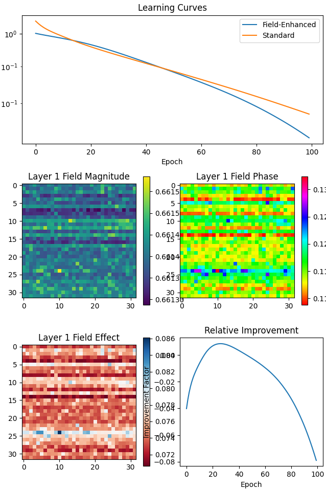

# Field-Enhanced Neural Network (FENN) vs. Standard Neural Network Comparison

## Overview

This application demonstrates the Field-Enhanced Neural Network (FENN) and compares its performance against a Standard Neural Network (SNN)

### Installation Steps

1. **Clone the Repository**

   git clone https://github.com/anttiluode/fieldeffect.git

   cd fieldeffect
   
# Install Dependencies

pip install numpy torch matplotlib

# Usage

Run the application using the following command:

python app.py

# What Happens When You Run the App

Data Generation: Generates synthetic data for training both networks.

Model Training: Trains the Field-Enhanced Neural Network and the Standard Neural Network for a specified number of epochs.

Performance Tracking: Records loss values for both networks during training.

Visualization: Displays plots comparing learning curves, field magnitudes, phases, field effects, and relative improvements.

# Configurable Parameters

You can adjust the following parameters within the run_test function:

n_samples: Number of synthetic data samples (default: 1000)
input_size: Number of input features (default: 64)
output_size: Number of output features (default: 32)
field_size: Size of the field in each layer (default: (32, 32))
n_epochs: Number of training epochs (default: 100)

# Results

After running the application, you will observe:

Learning Curves: Shows the loss progression of both FENN and SNN over epochs.
Field Magnitude & Phase: Visual representations of the field parameters in the first layer.
Field Effect: Illustration of how the field influences the network's output.
Relative Improvement: A plot highlighting the percentage improvement of FENN over SNN across epochs.

# Conversation

I have been thinking about the field effect on the brain for a while now. Fractals etc. This was just a test 
I decided to do what would happen if a normal nn was given a synthetic field. I guess on one hand it gives it 
a extra dimension which could partly explain things. Things get real interesting when we start thinking about 
brain with its delicate neurons / field / phases.

Truth to be told. I am just a layman, wiht braindamage to boot. So take this with grain of sand, coding was 
by Claude. But if there is somethign to this, I guess it would make sense to add synthetic field effect to AI. 

# License

This project is licensed under the MIT License.
